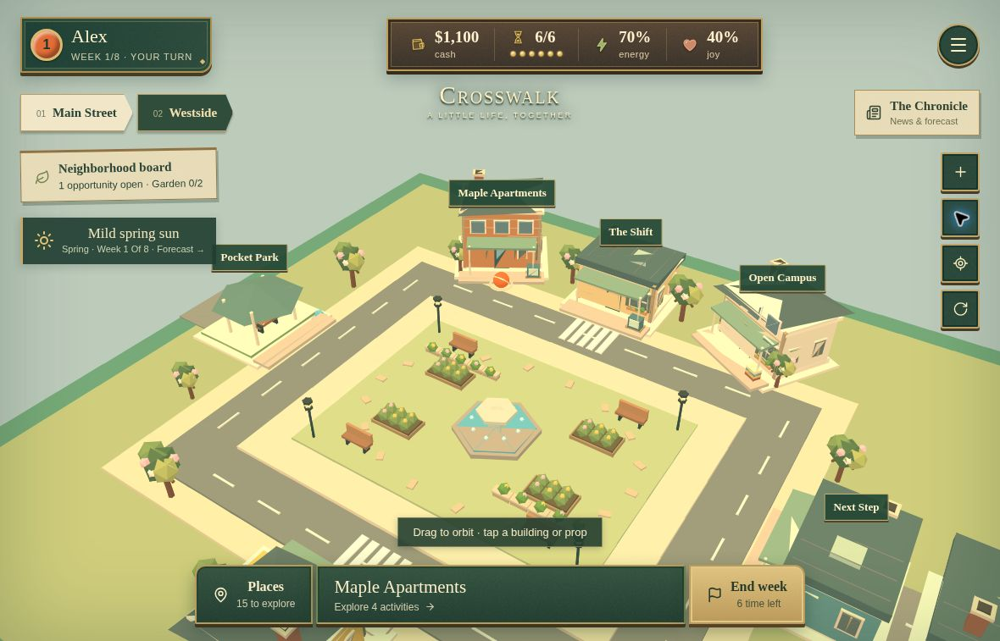
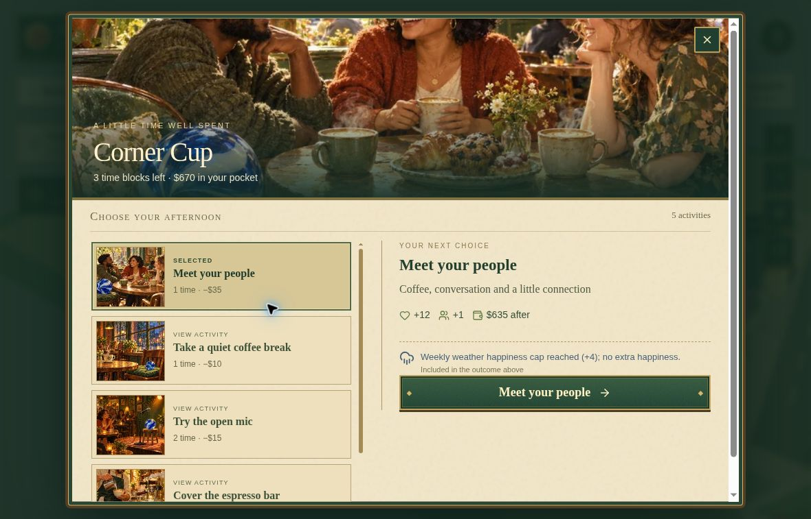
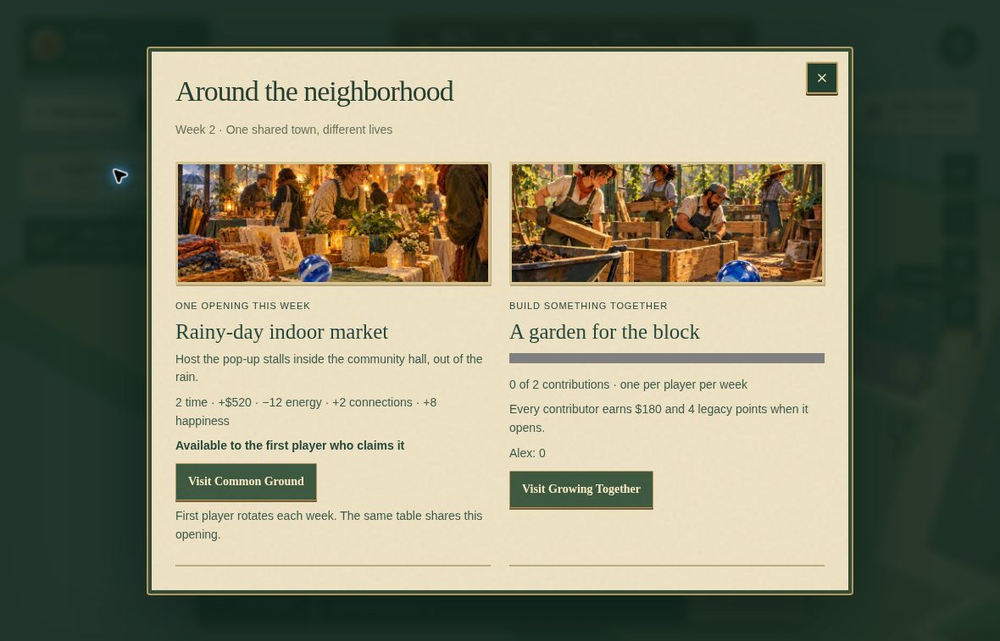

# Crosswalk

A 3D small-town life-simulation board game for **1–4 players**. Spend eight weeks balancing work, learning, friendships, energy, happiness and bills. A session is designed for roughly **20–30 minutes**.

**[Play Crosswalk](https://crosswalk-life-game.bensonlee5.chatgpt.site)**

## Screenshots

Actual gameplay from the current live build. Open any image for a full-size view.

[](docs/screenshots/town-overview.jpg)

*Explore the 3D town, choose a destination and plan the week around your time, cash, energy and happiness.*

| Illustrated activity choices | Around the neighborhood |
| --- | --- |
| [](docs/screenshots/illustrated-activities.jpg) | [](docs/screenshots/neighborhood-board.jpg) |
| Choose an illustrated café activity and preview its effects before committing. | Claim the week's shared opportunity or contribute to the neighborhood garden. |

## Features

- 15 modeled destinations and 74 activities, including neighbor chapters and shared projects
- Solo/pass-and-play on one device and online rooms across browsers
- Server-authoritative turns and persistent Cloudflare D1 room state
- Guest seats without account signup
- Three.js camera controls, keyboard and Places navigation
- Battery-saver and reduced-motion settings, plus software 3D rendering when WebGL is unavailable

## Neighborhood gameplay update

New games support career, community and creative life paths. Your strongest path earns up to 40 points, savings and happiness 25 each, and neighborhood legacy 10. There is no permanent class choice.

The weekly opportunity is shared by the room, with a rotating first player. Build the neighborhood garden together, and meet Mina, Eli and Jo across three chapters each. Their keepsakes and the growing garden appear in the 3D world. Activity menus stay open for deliberate repeats, and promotions announce the new role and wage.

Old rooms keep their original scoring, economy and turn order. Start a new game to use the neighborhood rules.

- [Detailed improvement plan](docs/GAMEPLAY-IMPROVEMENT-PLAN.md)
- [Verification and balance notes](docs/GAMEPLAY-VERIFICATION.md)
- `npm run test:balance` runs illustrative eight-week strategies; it is not an optimal-balance proof

## Local setup

Use Node.js **24** and npm (`.nvmrc` is included; the package requires Node >=22.13.0).

```sh
git clone https://github.com/bensonlee5/crosswalk.git
cd crosswalk
npm run install:ci
npm run build
npm run db:init:local
npm start
```

Open the loopback URL printed by Wrangler. Build first: it generates `dist/server/wrangler.json`, which the database and start commands need. Run `db:init:local` only once per fresh local database, because the SQL creates the initial table. Local records stay in ignored `.wrangler/state`. No production data or credentials are included.

For hot reload, run `npm run dev` after setup; the default address is `http://localhost:5173`. Dev and built previews share local D1 state. Use separate browser profiles/private windows to test different online seats; tabs in one profile share the guest cookie. Solo mode also uses the server and D1.

## Checks

```sh
npm test
npm run typecheck
npm run build
```

Tests cover classic and new activity previews, weekly bills, resource gates, shared claims/projects, story progression, rotating turns, legacy saves, stale snapshots, API ownership/idempotency and game completion. See [verification](docs/verification.md) for checks performed and device limitations.

## Source layout

- `app/game-screen.tsx`: game UI and room/activity flows
- `app/game-engine.ts`, `app/town-models.ts`, `app/neighborhood.tsx`: Three.js world, original meshes and React integration
- `app/api/game/route.ts`: guest-room API and authoritative turns
- `lib/game.ts`, `lib/game-view.ts`, `lib/locations.ts`: rules, previews and destinations
- `db/`, `drizzle/`: D1 schema and migrations
- `public/locations/`: original activity illustrations
- `tests/`: rules regression tests
- `build/`, `scripts/`: Worker build and local-development support

This repository preserves the current 3D game application source. Repository packaging adds a game README, setup/test commands and sanitized deployment configuration. The neighborhood gameplay update adds versioned rules while keeping classic saved games compatible. The previous Phaser dependency and old illustrated town maps are retained; the active game uses Three.js meshes.

## Deployment

This is a full-stack Worker application. GitHub Pages alone cannot run its room API. The existing game remains hosted on Sites; creating this repository does not change its deployment or configure automatic GitHub deployment.

Use a fresh Sites project or your own Worker and D1 database for a separate deployment. The checked-in `.openai/hosting.json` contains only the logical `DB` binding, not the original project ID. See [deployment](docs/deployment.md).

## Guest rooms and limitations

A random 256-bit HttpOnly, SameSite=Strict cookie identifies each browser (Secure over HTTPS). Room membership stores its SHA-256 digest, not the raw token. Responses omit membership and host hashes. Expected-version checks and a bounded request-ID history handle conflicting and duplicate moves.

Clearing cookies or changing browsers can lose access to a seat; there is no account recovery. Room codes expose lobby display names, so use nicknames and avoid personal information. This small-game implementation has no rate limiting, room expiry/cleanup, moderation, production monitoring or formal security audit. Review these before a high-traffic deployment.

## Artwork and licensing

All world meshes were authored for Crosswalk. The illustrated assets were generated for the game, not copied from another game's assets. See [asset provenance](docs/assets.md).

No project-wide license has been selected. Public visibility is not an additional license grant for the original code or artwork. Third-party dependencies and bundled notices retain their own terms; see `public/licenses/`, `build/sites-vite-plugin.LICENSE` and `vendor/`.


## Painted seasons

The neighborhood now has 45 oil-painted illustrations, a custom enamel-and-paper game interface, and an illustrated weekly Chronicle. New games use eight representative weeks across spring, summer, autumn and winter, with shared forecasts and capped activity effects. Time skips do not add bills. Existing saves retain their original mechanics.

The live 3D town changes foliage, lighting, roof snow and ground details. Rain and snow particles respect reduced motion and battery-saver mode. [Verification notes](docs/PAINTED-SEASONS-VERIFICATION.md) distinguish automated checks from device testing.

Additional checks: `node tests/weather.test.mjs`, `node tests/artwork.test.mjs`, `node tests/town-renderer.test.mjs`, and `node tests/balance-check.mjs --seasonal`.

### Illustrated activity choices

All 74 gameplay actions now have an explicitly mapped oil-painted scene and optimized selectable thumbnail, including all neighbor chapters, the shared garden and weekly opportunity variants. The update adds 57 individually generated paintings and 84 small thumbnails. Costs, outcomes and lock reasons remain accessible live text. The public art catalogue contains 102 full paintings plus the thumbnails, loaded on demand.

Run `node tests/action-artwork.test.mjs` for complete action-to-asset coverage, seasonal and pre-weather opportunity subjects, distinct scene bytes and thumbnail budgets. See [action-art verification](docs/ACTION-ART-VERIFICATION.md).

### Learn-as-you-play tutorial

New players are offered a short, optional field guide after the first Chronicle. It teaches resources, free travel, previewing and trying an activity, life paths, neighbors, seasonal news and the end-week bill review. The suggested first stop is The Shift; players may choose any legal activity or continue without acting.

- Skip at any point and replay from the game menu or How to play. Replaying never resets or recreates a game, buys anything or pays bills.
- Tutorial progress is versioned, device-local and separate from saved rooms. Interrupted guidance resumes after reload; existing saves do not receive a new automatic invitation.
- Instructions live inside the active Places/activity menu rather than covering its controls. News, handoff and bill dialogs temporarily hide the guide. Keyboard controls, visible focus, reduced motion and small-screen scrolling are supported.
- Classic and pre-weather saves receive rules-appropriate copy. The tutorial changes no game rules, balance, assets or server data.
- `node tests/tutorial.test.mjs` checks progression, event guards, skip/replay, interruption handling, save isolation and the suggested first activity. `node tests/tutorial-ui.test.mjs` checks rendered lessons and hook persistence, replay, repeated clicks and blocked browser storage.

### Places as invitations

Each of the 15 destinations now has its own promise, short arrival scene and material accent. Arriving selects a legal, relevant activity without reordering or hiding the full catalogue. A newcomer starts at home with a free reset, and at The Workshop with craft practice; explicit activity links still allow inspection of locked choices.

- Up to three optional invitations use current eligibility, resources, weather allowances, skill/craft unlocks and neighbor chapters. They take the player to a preview, never spend resources automatically, and yield to the tutorial.
- Choice previews lead with the benefit, then show time, upfront cost, gross income and net gain where relevant, energy/skill/social requirements, and remaining cash. A studio move explicitly shows its $705 ongoing weekly bills.
- Neighbor presence and small post-action links suggest a next chapter or newly unlocked role. They never promise a ninth week or fabricate opening hours, scarcity or weather closures.
- Existing rules, saves, all 74 actions, artwork, turn order and tutorial behavior are unchanged. The selected action appears first on small screens while the full activity list keeps its stable order.
- `node tests/place-invitations.test.mjs` checks 1,000 classic/weather/resource states and all action previews. `node tests/place-invitations-ui.test.mjs` checks rendered copy, guards, preview ordering and non-mutating rendering.
